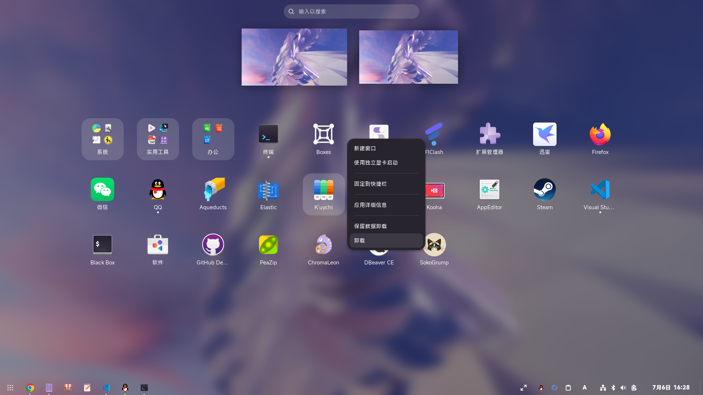

# fastUninstallApp
### 一键卸载应用

## 使用方法
### 安装稳定版
下载[插件文件](./uninstall-app@oninesixy.zip)，运行 `gnome-extensions install uninstall-app@oninesixy.zip` 安装插件
### 安装开发版
克隆该仓库并运行 `./.build.sh` 生成插件文件，然后运行 `gnome-extensions install uninstall-app@oninesixy.zip` 安装插件
### 卸载
该插件可直接通过卸载插件进行卸载，不会在系统中残留文件，配置文件直接放在了插件目录里

## 关于上架Gnome插件商店
我不打算把它上架到Gnome插件商店，Gnome插件商店的审核机制太严了，一直审核不通过